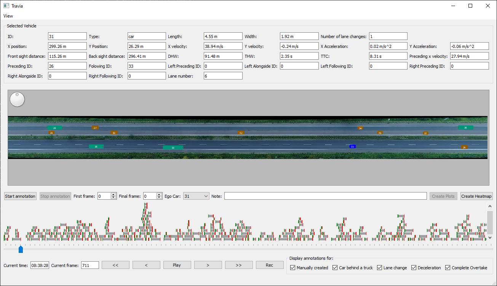

# Travia: a TRAffic VIsualition and Annotation tool

In recent years many open datasets have been published that contain vehicle trajectories of human drivers on public roads. Such datasets can be useful for all
kinds of research targeting traffic, e.g. traffic-flow studies and the development of autonomous vehicles. These datasets contain very large amounts of valuable
data, however, they often focus on collecting data in one country and in one situation, e.g. highway traffic in Germany. To broaden the scope of a research
project, it can be valuable to include data from different datasets. This is often difficult because traffic data comes in *.csv files, often without a way to
visualise and annotate the data for a quick start of your project. This is why Travia was created to combine te potential of different datasets by bringing them
together in one tool for visualisation and annotation.

Datasets from three different projects can currently be visualized using Travia. The NGSIM project collected data using camera's on tall buildings next to roads
in the USA. The PNeuma project captured all traffic during the morning rush-hour in the business district of Athens, for 5 days. To maximize precision and
coverage this was done using drones. Finally, the HighD project also used drones to record traffic on 6 locations at German highways.

TraViA was build as a broad basis for visualisation and manual annotation, it can easily be extended to incorporate the specific needs of your research project.
Three examples of such specific implementations are included in Travia to illustrate the possibilities and provide a starting point for other developers. The
first example considers automatically detecting and annotating specific situations in the HighD datasets. The second example is the plotting of heatmap
overlays, to aid with the design of reward functions for autonomous driving. Finally it includes an example of plotting vehicle signals on an annotated
selection of data.

Travia was tested with Python 3.8 on Windows.

## Installation

To install TraViA, simply clone the repository and install all requirements from the `requirements.txt` file using pip (run `pip install -r requirements.txt` in
the terminal from the travia folder). That's all!

To use TraViA, you'll need some traffic data, this data is not included in the repository. Follow the steps below to get started and test if TraViA is
functioning properly.

## Getting started, visualize data in 4 steps

To get started, you only need to execute the next 4 steps.

1. acquire data
2. extract in the correct folder
3. alter `visualize.py` (run file)
4. run

### Acquire data

The data to visualize is not included in Travia, you need to acquire the data and a valid license to use it yourself. All implemented datasets are free for use
for scientific purposes. In this example we will acquire the NGSim data set, but if you already have a copy of one of the supported datasets you can skip this
step. To acquire a copy of NGSim data, open a browser and navigate
to [this](https://data.transportation.gov/Automobiles/Next-Generation-Simulation-NGSIM-Vehicle-Trajector/8ect-6jqj)
page. Scroll down to find the attachments section under "about this dataset". Locate the attachment called "US-101-LosAngeles-CA.zip" and click it to start the
download. This contains data recorded on the US-101 highway.

### Extract in the right folder

To use the data, it has to be placed in the `travia/data` folder to be found automatically when loading the dataset. The data folder has three sub-folders, one
for each data source. For our example we need the NGSim sub-folder, but if you have data from another project please see the `README.txt` file in the
corresponding sub-folder for instructions. For now, navigate to your freshly downloaded data and extract the contents of `US-101-LosAngeles-CA.zip`
to `travia/data/NGSim`. This should create a new folder, `travia/data/NGSim/US-101-LosAngeles-CA`, which contains more zip files. Extract the contents of
`aerial-ortho-photos.zip` and `vehicle-trajectory-data.zip` to this folder. This will create more sub-folders, a representation of the correct end-result can be
found in the `README.txt` file located in `travia/data/NGSim`, please verify that your folder structure is correct.

### Alter `visualize.py` (run file)

The script to start TraViA is a file called `visualize.py` and it can be found in the main project folder. This file is where you indicate which dataset you
want to load. Open the file now and look for the code below `if __name__ == '__main__':`. Uncomment the part needed to load a NGSim dataset, and comment the
other parts. As you can see, each dataset is identified with a DatasetID enum object. The NGSim and PNeuma dataset are split in parts based on recording
location and time, the HighD data is split up in indexed sub-sets. The enum objects correspond to the divisions made in the data source.

For our example, we need to change this dataset_id to a dataset ID corresponding to a dataset from the `NGSIM-US101`-location, so change it to
`NGSimDatasetID.US101_0805_0820`. Here, `US101` refers to the location of the recording and `0805_0820` to the time of the recording (between 08:05 and 08:20
AM).

### Run

Now you're ready to run visualize.py. This will load the data from the *.csv file and convert it to a dataset object. Loading a new NGSim dataset for the first
time will take a while, since the data will be smoothed first. This is done to calculate headings for all vehicles because these are not included in the
dataset. For more information, check out the section on "Particularities with the data". This smoothing is also needed for PNeuma datasets.

Once done, the TraViA user interface should be displayed. A screenshot of how it should look like can be found below. This screenshot shows a portion of the
HighD dataset, so don't worry if the traffic looks different. To verify TraViA is working correctly, a video is included with the
repository (`./paper/image/US101_0805_0820.mp4`). You can compare the visualisation of the NGSim data from the example with this video to verify TraViA is
working correctly.

## How to use TraViA

TraViA was built with two use cases in mind, the first being to provide a quick visualisation and annotation opportunity for researchers working with open
traffic data. For this use case, all interaction between the user and TraViA can take place in the GUI. An example of such use would be a researcher that
performed numerical analysis on the data from the HighD dataset in a custom-made script. If this analysis shows something happening at frame x for vehicle y
that is hard to explain numerically, TraViA can be used to a) investigate what is happening in a visualisation and b) annotate this event for future use. For
such use, the user interface of TraViA is explained below in the subsection user interface.

The second potential use-case is for researcher to extent TraViA for their own use, for example to visualise other (closed access) datasets or to implement
Autonomous vehicle controllers that operate in the traffic data environment. To aid in this use-case, a high-level overview of the architecture of TraViA is
provided in the subsection High-Level Software Architecture.

TraViA was **not** designed to be imported as a module or library for use in other software projects. For that reason, TraViA has no `setup.py` file, is not
available on PyPi and there is no API provided for software interfacing with TraVia.

### User Interface

The Travia user interface consists of four parts (see the figure above for more information). From top to bottom, you'll see a vehicle information pane,
displaying all data of the selected vehicle, a view of the road and traffic, the annotation overview and controls, and finally the timeline controls.

The traffic view can be panned by dragging with the mouse, zoomed by using the scroll wheel and rotated using the knob on the top left. To display information
on a single vehicle you can select it by clicking it. The same holds for annotations, they are represented by bars just above the timeline. By clicking a bar,
the annotation is selected and its information is displayed. It is not possible to selected multiple annotations or vehicles at once.

The "start annotation" button will open a new annotation that starts at the current frame. After this it is possible to edit the start and end frames, ego
vehicle ID (the vehicle of interest) and add a note. The "stop annotation" button will then save the annotation.

The time can be controlled by using play/pause button in the lower part of the interface. The time can be fast forwarded using the >> button and reversed with
the << button. The > and < buttons will execute a single frame step. The rec button will start a video recording of the visualisation, this recording can be
stopped by clicking the pause button and will then be exported to the users video folder. A single frame can be saved as an image through the view menu. The
buttons "Create Plots" and "Create Heatmap" are used for example function and only work with HighD datasets. Please see the section HighD example tools below
for more information.

### High-Level Software Architecture

There are three main objects in TraViA used in for visualizing the data, a conceptual UML class diagram can be found in the figure above. The highest level 
object is the Graphical User Interface (GUI). This inherits from the Qt QMainWindow object and handles all user interaction. The state of the GUI is 
periodically updated by a VisualisationMaster object. This is the object that translates the specific format of the dataset to store the data for every 
vehicle in a generic vehicle objects. This way of working ensures that the dataset itself is used in its original format such that all original documentation 
can be used and other scripts based on that documentation will still work. But TraViA uses the same generic `Vehicle` object for all datasets such that tools 
developed in TraViA can easyli be used on multiple datasets.
  
The visualisation master object also keeps track of the clock to allow real-time visualisation. For every data source there is a specific VisualisationMaster 
that inherits from a VisualisationMaster base class. The data itself is stored in a Dataset object, again there is a specific class for each source, inheriting 
form a base class. As sais, the Dataset objects preserve the format of the data source by storing the contents of `*.csv` data files in pandas DataFrame 
objects. Only for the pNEUMA data, the original format of storing a vehicle per row is reshaped to storing a frame per row to obtain a DataFrame with equal 
length rows. All data stored in the Dataset objects is converted to SI units, global coordinates are converted to suitable local coordinate systems in meters. 
Metadata on the dataset is stored as `Dataset` object attributes.

## Datasets and how to get them

As said before, Travia supports data from three different projects:

- [HighD](https://www.highd-dataset.com/)
- [NGSim](https://ops.fhwa.dot.gov/trafficanalysistools/ngsim.htm)
- [PNeuma](https://open-traffic.epfl.ch/)

Follow these links to the websites of the projects. There, you can find more information on how to obtain a copy of the data, and a license to use it.

### Particularities with the data

There are some particularities with these datasets that had to be accounted for in Travia. These particularities and the solutions implements in Travia are
listed here. Please have a look at the code to get a better idea of the specific implementation. If you find any other issues, or extensions of these issues
that are not accounted for. Please submit a bug report and/or a pull request containing a fix on the GitHub repository.

**Heading detection with Kalman smoother**

None of the datasets provide headings for the vehicles. For the HighD data this is no problem since the highways are straight, and the headings can  
be assumed to be either 0 or pi at these high velocities. But for the NGSim and PNeuma datasets, headings have to be estimated to visualize the data. This is
done automatically using an unscented Kalman smoother in `processing/kalmansmoothing.py`. The smoother uses a bicycle model to estimate the dynamics of
vehicles. These smoothers were manually tuned to provide results that are good enough for visualization purposes, but only that. If you want to use the smoothed
data for anything else then visualization, please verify that the smoother did not introduce problems for your approach.

**missing vehicle sizes in PNeuma**

The PNeuma dataset does not include vehicle sizes for the individual vehicles, only a very specific vehicle type. To account for this, generic vehicle
dimensions were estimated for all vehicle types. These dimensions cen be found in `dataobjects/enums/vehicletype.py`.

**Mixed files in NGSim**

At two locations of the NGSim project, Peachtree and Lankershim, the collected data was not split in files per time slot. It was all stored in a single file,
but the vehicle ID's were reset at the second timeslot. To display the data properly, it has to be split in different datasets. This is done automatically when
loading one of these files. The functions that do this can be found in `processing/NGSIMsplitting.py`. An added issue with the Peachtree dataset is the fact
that the timestamps are also corrupted. The first timestamp is correct but from that point on 100 seconds are added every time step instead of 100 ms. This is
also fixed in the same function.

**Typos in NGSim**

Some NGSim files contain typos in the header. This is taken care of when loading the NGSim *.csv file in `dataobjects/ngsimdataset.py` (`read_ngsim_csv`
function).

**NGSim data in feet**

All NGSim data is provided in feet. All values are converted to SI-units in `dataobjects/ngsimdataset.py` (`read_ngsim_csv` function).

**Velocity in km/h in Pneuma data**
The PNeuma data is provided with velocities in km/h, this is converted to m/s in `dataobjects/pneumadataset.py` (`read_pneuma_csv` function).

### Where to place the data

If you want to load the data automatically, it should be stored in the data folder. This folder contains sub-folders for every project, these sub-folders
contain README.txt files explaining the folder structure in this sub-folder. In general the procedure is the same as in the example above, download the data and
extract the files in the data folder as specified in the README.txt file.

### How data is stored

All data comes in *.csv files, these are great for general use but take some time to convert to usable Python objects. To shorten the loading time, Travia will
load the raw data from the *.csv files once and then store the created Python objects using pickle. However, opening pickle objects from an unknown source poses
a security risk. To minimize this risk, Travia encrypts the pickle files using a key that will be generated and saved in your home folder at first use.

This ensures that you will only open files that were created on your own computer (or with access to your key). However, it also means that you cannot share *
.pkl files with other people or between computers. To enable your annotations to be shared, they will also be saved in a *.csv file. These annotation files will
be found and loaded automatically when first creating the python objects.

### HighD example tools

To illustrate the possibilities for extension of Travia, three example functionalities have been implemented on the HighD dataset

- Rendering an overlay heatmap
- Plotting annotation data
- Automatic annotation of situations

The rendering of an overlay and plotting of annotation data are both implemented in `gui/gui.py` (`_toggle_overlay` and `_create_plots` respectively). These
function have comments and should be enough to get you started on implementing your own overlay of plots.

The automatic annotation of situations can be performed using the `annotate_highd.py`. It will automatically detects interesting scenarios and add annotations
accordingly. please have a look at `processing/automaticannotationhighd.py` for more information.

For more help with these example implementations or if you have specific questions about them, please submit an issue on github.

## Contributing to TraViA

Contributions to TraViA are very welcome, if you want to make a contribution you can open a pull-request on GitHub. Please stick to pythons pep-8 guideline and
clean-coding standards in general. The only deviation from pep-8 (that was made on purpose) is the maximum line-width, this was increased from 120 characters to
160 character because we all have wide-screen monitors anyway.

Also, please keep in mind the design choices that were made when creating TraViA. To summarize them: TraViA is created to serve as a broad basis for research on
traffic data in many disciplines. It was created such that is can easily be extended for specific use, but was not meant to be not imported in other projects.
For these reasons, contributions that are too specific and are build for only one research project will be rejected (but can be made open access in separate
repositories). Contributions that are general enough for use in different projects but that are only useful for a sub-group of traffic data users might be added
to TraViA in a sepperate branch.

If you have questions about using or extending TraViA, or if you found a bug, please open an issue on GitHub.
